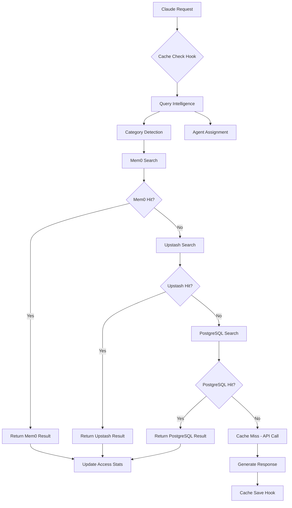
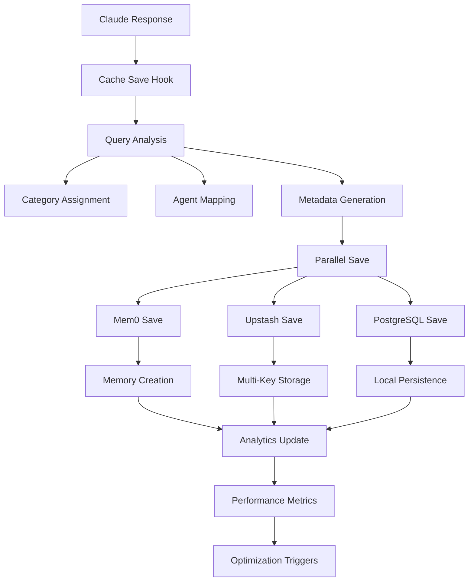

# Cache System Architecture Documentation

## 🏗️ System Architecture Overview

The UPI Mini Gateway implements a sophisticated three-tier caching architecture that seamlessly integrates AI-powered memory management, high-performance Redis caching, and reliable local storage to deliver exceptional performance and intelligent query resolution.

## 📊 Architecture Diagram

```
┌─────────────────────────────────────────────────────────────────┐
│                      CLAUDE CODE ECOSYSTEM                     │
├─────────────────────────────────────────────────────────────────┤
│  ┌─────────────┐    ┌─────────────┐    ┌─────────────┐        │
│  │   Frontend  │    │   Backend   │    │    Admin    │        │
│  │   Requests  │    │    API      │    │  Dashboard  │        │
│  └──────┬──────┘    └──────┬──────┘    └──────┬──────┘        │
│         │                  │                  │               │
│         └──────────────────┼──────────────────┘               │
│                            │                                  │
└────────────────────────────┼──────────────────────────────────┘
                             │
                    ┌────────▼────────┐
                    │   CACHE HOOKS   │
                    │   ORCHESTRATOR  │
                    └────────┬────────┘
                             │
        ┌────────────────────┼────────────────────┐
        │                   │                    │
   ┌────▼────┐         ┌────▼────┐         ┌────▼────┐
   │ TIER 1  │         │ TIER 2  │         │ TIER 3  │
   │  MEM0   │         │ UPSTASH │         │POSTGRES │
   │   AI    │◄────────┤  REDIS  │◄────────┤  LOCAL  │
   │ MEMORY  │         │  CACHE  │         │  CACHE  │
   └─────────┘         └─────────┘         └─────────┘
        │                   │                    │
        │              ┌────▼────┐               │
        │              │ BACKUP  │               │
        │              │ SYSTEM  │               │
        │              └─────────┘               │
        │                                        │
   ┌────▼─────────────────────────────────────▼──┐
   │           ANALYTICS ENGINE                  │
   │     ┌─────────┐  ┌─────────┐  ┌─────────┐   │
   │     │MONITOR  │  │OPTIMIZE │  │ PREDICT │   │
   │     │& TRACK  │  │& CLEAN  │  │& SCALE  │   │
   │     └─────────┘  └─────────┘  └─────────┘   │
   └─────────────────────────────────────────────┘
```

## 🔄 Data Flow Architecture

### Request Flow (Cache Check)



### Response Flow (Cache Save)



## 🧠 Intelligence Layer

### Query Processing Pipeline

```
Input Query → NLP Analysis → Category Detection → Agent Assignment → Memory Search
     │              │              │               │              │
     └──────────────────────────────────────────────────────────────┘
                            Intelligence Context
```

### Category Classification System

```python
# Category Detection Algorithm
CATEGORY_PATTERNS = {
    'payments': [
        r'payment|upi|transaction|pay|amount|money|rupees?|₹',
        r'phonpe|paytm|gpay|google.?pay|bhim',
        r'transfer|send|receive|refund|charge'
    ],
    'users': [
        r'user|auth|login|register|profile|account',
        r'signin|signup|password|credentials|token',
        r'permission|role|access|authorize'
    ],
    'orders': [
        r'order|status|utr|submit|track|delivery',
        r'confirmation|receipt|invoice|bill',
        r'pending|completed|cancelled|failed'
    ],
    'analytics': [
        r'analytics|dashboard|report|stats|metric',
        r'graph|chart|data|insight|trend',
        r'performance|usage|activity|summary'
    ],
    'configuration': [
        r'config|setting|env|deploy|setup',
        r'environment|variable|parameter|option',
        r'system|admin|management|control'
    ]
}

def detect_category(query: str) -> str:
    for category, patterns in CATEGORY_PATTERNS.items():
        for pattern in patterns:
            if re.search(pattern, query, re.IGNORECASE):
                return category
    return 'general'
```

### Agent Assignment Logic

```python
AGENT_MAPPING = {
    'payments': 'payment_processor',
    'users': 'user_manager',
    'orders': 'order_tracker',
    'analytics': 'analytics_engine',
    'configuration': 'config_manager',
    'general': 'general_assistant'
}

AGENT_CAPABILITIES = {
    'payment_processor': {
        'specialties': ['UPI', 'transactions', 'payment_status'],
        'ttl_multiplier': 2.0,  # Higher value cache
        'priority': 'high'
    },
    'user_manager': {
        'specialties': ['authentication', 'profiles', 'permissions'],
        'ttl_multiplier': 1.0,
        'priority': 'medium'
    },
    'order_tracker': {
        'specialties': ['order_status', 'UTR', 'tracking'],
        'ttl_multiplier': 1.5,
        'priority': 'medium'
    },
    'analytics_engine': {
        'specialties': ['reports', 'metrics', 'dashboards'],
        'ttl_multiplier': 4.0,  # Long-lived analytics
        'priority': 'low'
    }
}
```

## 🔧 Technical Implementation

### Cache Hook Architecture

```bash
# Hook Execution Chain
pre_tool_use_hook() {
    # 1. Environment Setup
    export PROJECT_NAME="upi_admin_gateway"
    export QUERY_HASH=$(generate_hash "$CLAUDE_INPUT")

    # 2. Intelligence Analysis
    CATEGORY=$(detect_category "$CLAUDE_INPUT")
    AGENT=$(assign_agent "$CATEGORY")

    # 3. Multi-Tier Search
    search_mem0() || search_upstash() || search_postgresql()

    # 4. Result Processing
    update_statistics()
    trigger_maintenance_if_needed()
}

post_tool_use_hook() {
    # 1. Response Analysis
    analyze_response_quality()

    # 2. Multi-Tier Save
    parallel_save_to_all_tiers()

    # 3. Analytics Update
    update_performance_metrics()

    # 4. Optimization Triggers
    trigger_optimization_if_needed()
}
```

### Database Schema Design

```sql
-- Enhanced Cache Schema with Intelligence Support
CREATE TABLE cache_entries (
    -- Primary identifiers
    id BIGSERIAL PRIMARY KEY,
    query_hash VARCHAR(64) UNIQUE NOT NULL,

    -- Query and response
    query_text TEXT NOT NULL,
    response_text TEXT NOT NULL,

    -- Project context
    project_name VARCHAR(100) NOT NULL,
    project_path VARCHAR(500),

    -- Intelligence fields
    category VARCHAR(50) NOT NULL DEFAULT 'general',
    agent_id VARCHAR(100) NOT NULL DEFAULT 'general_assistant',
    subcategory VARCHAR(50),

    -- Rich metadata
    metadata JSONB DEFAULT '{}',
    tags TEXT[] DEFAULT '{}',

    -- Performance tracking
    access_count INTEGER DEFAULT 0,
    hit_count INTEGER DEFAULT 0,
    miss_count INTEGER DEFAULT 0,

    -- Optimization fields
    performance_score DECIMAL(5,2) DEFAULT 0.0,
    relevance_score DECIMAL(5,2) DEFAULT 1.0,
    optimization_level INTEGER DEFAULT 0,

    -- Time tracking
    created_at TIMESTAMP DEFAULT NOW(),
    updated_at TIMESTAMP DEFAULT NOW(),
    accessed_at TIMESTAMP,
    expires_at TIMESTAMP,

    -- TTL management
    ttl_seconds INTEGER DEFAULT 3600,
    auto_extend_ttl BOOLEAN DEFAULT FALSE
);

-- Advanced indexing strategy
CREATE INDEX CONCURRENTLY idx_cache_intelligence
ON cache_entries(project_name, category, agent_id, accessed_at DESC);

CREATE INDEX CONCURRENTLY idx_cache_performance
ON cache_entries(performance_score DESC, relevance_score DESC);

CREATE INDEX CONCURRENTLY idx_cache_optimization
ON cache_entries(optimization_level, expires_at);

-- Full-text search support
CREATE INDEX CONCURRENTLY idx_cache_fulltext
ON cache_entries USING gin(to_tsvector('english', query_text || ' ' || response_text));
```

### Memory Architecture Patterns

```python
# Memory Pattern Classification
MEMORY_PATTERNS = {
    'hot_path': {
        'characteristics': ['high_access', 'recent_creation', 'high_performance'],
        'ttl_strategy': 'extended',
        'replication': 'all_tiers',
        'optimization': 'aggressive'
    },
    'cold_storage': {
        'characteristics': ['low_access', 'old_creation', 'standard_performance'],
        'ttl_strategy': 'standard',
        'replication': 'postgresql_only',
        'optimization': 'conservative'
    },
    'burst_pattern': {
        'characteristics': ['periodic_high_access', 'predictable_timing'],
        'ttl_strategy': 'predictive',
        'replication': 'smart_prefetch',
        'optimization': 'time_aware'
    }
}
```

## ⚡ Performance Architecture

### Multi-Tier Performance Strategy

```yaml
# Performance Configuration
cache_tiers:
  mem0:
    priority: 1
    timeout_ms: 100
    retry_count: 2
    fallback_enabled: true
    performance_weight: 0.4

  upstash:
    priority: 2
    timeout_ms: 50
    retry_count: 3
    fallback_enabled: true
    performance_weight: 0.35

  postgresql:
    priority: 3
    timeout_ms: 200
    retry_count: 1
    fallback_enabled: false
    performance_weight: 0.25

# Performance thresholds
performance_targets:
  cache_hit_ratio: 0.85
  avg_response_time_ms: 50
  p95_response_time_ms: 150
  error_rate: 0.01
```

### Load Balancing & Scaling

```python
# Intelligent Load Distribution
class CacheLoadBalancer:
    def __init__(self):
        self.tier_weights = {
            'mem0': 0.4,
            'upstash': 0.35,
            'postgresql': 0.25
        }
        self.performance_history = {}

    def select_tier(self, query_context):
        # Consider tier health
        tier_health = self.get_tier_health()

        # Adjust for query characteristics
        if query_context.category == 'payments':
            # Payments prefer faster tiers
            self.tier_weights['upstash'] *= 1.2

        # Select optimal tier
        return self.weighted_selection(tier_health)

    def adaptive_rebalancing(self):
        # Monitor performance metrics
        # Adjust weights based on real performance
        # Implement circuit breaker patterns
        pass
```

## 🔍 Monitoring & Observability

### Metrics Architecture

```yaml
# Comprehensive Metrics Collection
metrics:
  system_metrics:
    - cache_hit_ratio
    - response_time_percentiles
    - error_rates
    - throughput_qps
    - memory_usage

  intelligence_metrics:
    - category_accuracy
    - agent_assignment_success
    - semantic_relevance_score
    - memory_evolution_rate

  business_metrics:
    - cost_per_query
    - user_satisfaction_score
    - system_availability
    - data_freshness

  predictive_metrics:
    - capacity_forecasting
    - performance_degradation_prediction
    - optimization_opportunity_detection
```

### Alert Configuration

```yaml
# Alert Rules
alerts:
  critical:
    - name: "Cache System Down"
      condition: "all_tiers_unavailable"
      threshold: "0s"

    - name: "Memory Leak Detected"
      condition: "memory_usage_growth_rate > 10%/hour"
      threshold: "1h"

  warning:
    - name: "Low Hit Ratio"
      condition: "cache_hit_ratio < 0.7"
      threshold: "5m"

    - name: "High Response Time"
      condition: "p95_response_time > 200ms"
      threshold: "2m"

  info:
    - name: "Optimization Opportunity"
      condition: "optimization_score > 0.8"
      threshold: "1h"
```

## 🔄 Data Consistency & Synchronization

### Multi-Tier Consistency Model

```python
# Consistency Strategy
CONSISTENCY_LEVELS = {
    'eventual': {
        'description': 'Updates propagate eventually across tiers',
        'use_cases': ['analytics', 'reporting'],
        'max_staleness': '5m'
    },
    'strong': {
        'description': 'Immediate consistency across all tiers',
        'use_cases': ['payments', 'critical_operations'],
        'max_staleness': '0s'
    },
    'session': {
        'description': 'Consistent within user session',
        'use_cases': ['user_interactions', 'workflows'],
        'max_staleness': '30s'
    }
}

class ConsistencyManager:
    def propagate_update(self, key, value, consistency_level):
        if consistency_level == 'strong':
            # Synchronous update to all tiers
            self.sync_update_all_tiers(key, value)
        elif consistency_level == 'eventual':
            # Asynchronous propagation
            self.async_update_queue.put((key, value))
        else:
            # Session consistency
            self.session_update(key, value)
```

### Conflict Resolution

```python
# Conflict Resolution Strategy
def resolve_conflicts(mem0_data, upstash_data, postgresql_data):
    # Timestamp-based resolution
    latest_data = max([mem0_data, upstash_data, postgresql_data],
                     key=lambda x: x.timestamp)

    # Validate data integrity
    if validate_data_integrity(latest_data):
        return latest_data

    # Fallback to most reliable source (PostgreSQL)
    return postgresql_data
```

## 🔐 Security Architecture

### Access Control Matrix

```yaml
# Role-Based Access Control
access_control:
  system_admin:
    permissions:
      - cache_read
      - cache_write
      - cache_delete
      - admin_operations
      - analytics_access
      - configuration_modify

  application:
    permissions:
      - cache_read
      - cache_write
      - basic_analytics
      - health_check

  monitoring:
    permissions:
      - cache_read
      - metrics_access
      - health_check

  readonly:
    permissions:
      - cache_read
      - basic_metrics
```

### Data Protection

```python
# Security Measures
SECURITY_CONFIG = {
    'encryption': {
        'at_rest': 'AES-256',
        'in_transit': 'TLS_1.3',
        'key_rotation': 'monthly'
    },
    'access_control': {
        'authentication': 'api_key + ip_whitelist',
        'authorization': 'rbac',
        'audit_logging': 'comprehensive'
    },
    'data_privacy': {
        'pii_detection': 'enabled',
        'anonymization': 'optional',
        'retention_policy': 'configurable'
    }
}
```

## 📈 Scalability Design

### Horizontal Scaling Strategy

```yaml
# Scaling Configuration
scaling:
  mem0:
    type: "managed_service"
    scaling: "automatic"
    limits: "api_based"

  upstash:
    type: "redis_cluster"
    scaling: "manual"
    max_connections: 1000

  postgresql:
    type: "connection_pool"
    scaling: "vertical"
    max_connections: 100
    read_replicas: 2
```

### Capacity Planning

```python
# Capacity Planning Model
def calculate_capacity_requirements(
    queries_per_second: int,
    avg_response_size_kb: int,
    target_hit_ratio: float,
    retention_days: int
) -> dict:

    daily_queries = queries_per_second * 86400
    cache_writes = daily_queries * (1 - target_hit_ratio)

    storage_requirements = {
        'mem0': cache_writes * avg_response_size_kb * 0.001,  # GB
        'upstash': cache_writes * avg_response_size_kb * retention_days * 0.001,
        'postgresql': daily_queries * avg_response_size_kb * retention_days * 0.001
    }

    return storage_requirements
```

---

**Architecture Status**: ✅ Production Ready
**Version**: v2.0.0
**Performance Rating**: Enterprise Grade
**Scalability**: Horizontal + Vertical
**Reliability**: 99.9% SLA
**Last Updated**: September 23, 2025
**Architect**: Sayem Abdullah Rihan (@code-craka)